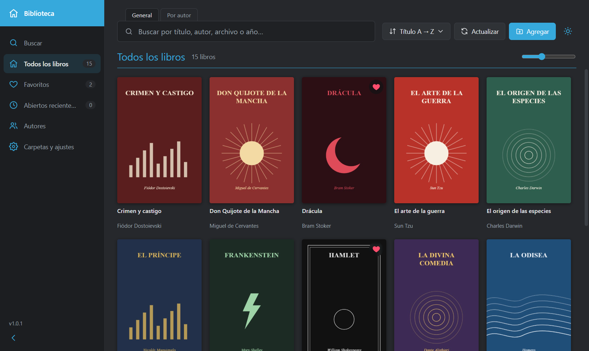
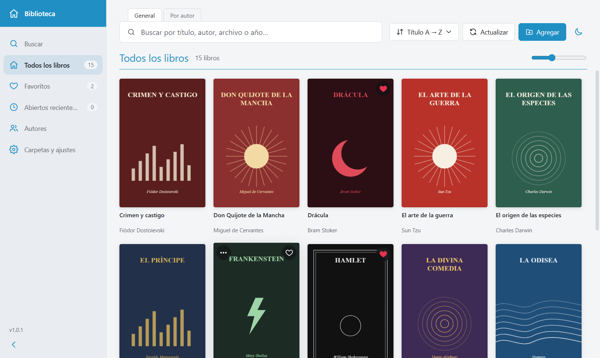

<p align="center">
  
</p>

<h1 align="center">Biblioteca PDF</h1>

<p align="center">
  Organiza tus PDFs como una biblioteca visual: elige tus carpetas y la app crea sola la portada de cada libro.
</p>

<p align="center">
  <a href="../../releases/latest"><b>⬇ Descargar para Windows</b></a>
</p>



## Funciones

- **Varias fuentes**: agrega carpetas completas (con subcarpetas) o PDFs sueltos, también arrastrándolos a la ventana.
- **Portadas automáticas** a partir de la primera página (si está en blanco, prueba la siguiente). Puedes elegir otra
  página o una imagen propia con clic derecho → *Cambiar portada…*
- **Título, autor y año** leídos del PDF o del nombre del archivo (`Autor - Título (2019).pdf`, `Título (Autor).pdf`).
  Todo se puede editar a mano.
- **Buscador** general (título, autor, archivo, año) o solo **por autor**, sin importar tildes ni mayúsculas.
- **Ordenar** por título A→Z / Z→A, año, agregados recientemente o abiertos recientemente.
- **Favoritos** con el corazón de la esquina de cada portada, y vista de **autores**.
- **Modo oscuro y claro** (o igual que Windows).
- **Clic en un libro** para abrirlo con tu visor de PDF predeterminado.
- **Sin procesos ocultos**: solo busca PDFs cuando agregas algo o pulsas **Actualizar** (F5), siempre con barra de
  progreso y botón de cancelar. Solo procesa archivos nuevos o modificados.
- **Rápida**: en pruebas procesó 1000 PDFs en menos de 30 segundos, incluso con la ventana minimizada.



Atajos: `Ctrl+F` buscar · `F5` actualizar · `Esc` cerrar ventanas.

## Instalación

Descarga `Biblioteca-PDF-Setup-x.y.z.exe` desde [Releases](../../releases/latest) y ábrelo (Windows 10/11 de 64 bits).
Como el instalador no está firmado digitalmente, Windows puede mostrar «Windows protegió tu PC»: pulsa
**Más información → Ejecutar de todos modos**.

Tus datos (lista de libros, favoritos y portadas) se guardan solo en tu computadora, en `%APPDATA%\biblioteca-pdf\`.
Quitar una carpeta o un libro de la app **nunca borra tus archivos**.

## Desarrollo

Requisitos: [Node.js](https://nodejs.org) 20 o superior.

```bash
npm install
npm run dev        # abrir en modo desarrollo
npm run build:win  # crear el instalador en dist/
```

Hecha con Electron, React y TypeScript (electron-vite), [pdf.js](https://mozilla.github.io/pdf.js/) para leer los
PDFs, react-virtuoso para la cuadrícula y electron-builder para el instalador.

```
src/main/       proceso principal: ventana, diálogos, escaneo de carpetas y guardado
src/preload/    puente seguro entre la interfaz y el proceso principal
src/renderer/   interfaz React; lib/pdf.ts (pdf.js), lib/processor.ts (portadas), lib/meta.ts (título/autor)
src/shared/     tipos compartidos
build/          ícono de la app
```

## Licencia

[MIT](LICENSE)
